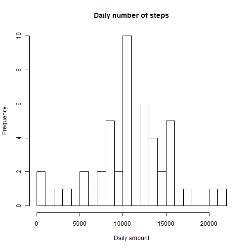
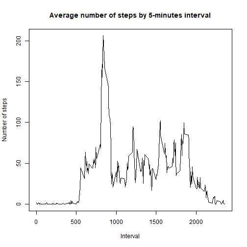
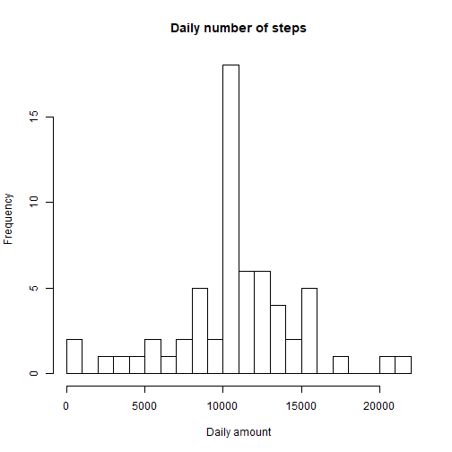
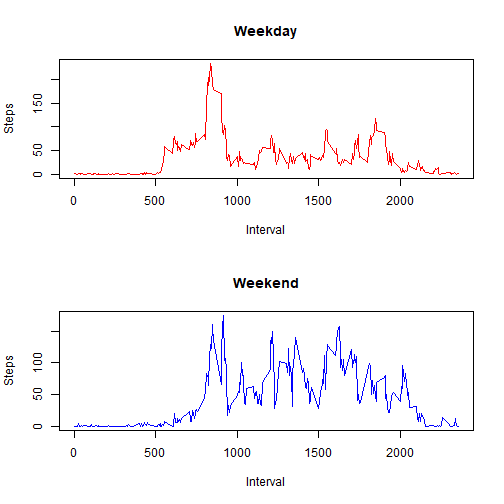

##Loading and preprocessing the data
Show any code that is needed to:  
1. Load the data (i.e. read.csv());  
2. Process/transform the data (if necessary) into a format suitable for your analysis - we consider dates as factors.


```r
data<-read.csv("activity.csv",sep=",")
data$date<-as.factor(data$date)
```

See the head of the file to check its shape.


```r
head(data)
```

```
##   steps       date interval
## 1    NA 2012-10-01        0
## 2    NA 2012-10-01        5
## 3    NA 2012-10-01       10
## 4    NA 2012-10-01       15
## 5    NA 2012-10-01       20
## 6    NA 2012-10-01       25
```

##What is mean total number of steps taken per day?
For this part of the assignment, you can ignore the missing values in the dataset.
Make a histogram of the total number of steps taken each day (not barplot!).


```r
data_agg<-aggregate(data$steps,by=list(data$date),FUN=sum)
hist(data_agg$x,xlab="Daily amount",main="Daily number of steps",breaks = 20)
```



Calculate and report the mean and median total number of steps taken per day.


```r
mean(data_agg$x,na.rm=T)
```

```
## [1] 10766.19
```

```r
median(data_agg$x,na.rm=T)
```

```
## [1] 10765
```

##What is the average daily activity pattern?
Make a time series plot (i.e. type = "l") of the 5-minute interval (x-axis) and the average number of steps taken, averaged across all days (y-axis).


```r
data_interval_mean<-aggregate(steps~interval,data=data,FUN=mean)
plot(data_interval_mean,type="l",xlab="Interval",ylab="Number of steps",main="Average number of steps by 5-minutes interval")
```



The 5-minute interval, on average across all the days in the dataset, containing the maximum number of steps is the 835th. 


```r
data_interval_mean[data_interval_mean$steps==max(data_interval_mean$steps),]
```

```
##     interval    steps
## 104      835 206.1698
```

##Imputing missing values
Calculate and report the total number of missing values in the dataset (i.e. the total number of rows with NAs).


```r
sum(!complete.cases(data))
```

```
## [1] 2304
```

Fill in all of the missing values in the dataset by using the mean for that 5-minute interval.
Create a new dataset that is equal to the original dataset but with the missing data filled in.


```r
data2<-read.csv("activity.csv",sep=",")
data2$date<-as.factor(data2$date)
for (x in 1:nrow(data2)){
  if (is.na(data2[x,1])){
    row<-data_interval_mean[data_interval_mean$interval==data2[x,3],]
    data2[x,1]<-row[1,2]
  }
}
```

Make a histogram of the total number of steps taken each day.


```r
data_agg2<-aggregate(data2$steps,by=list(data2$date),FUN=sum)
hist(data_agg2$x,xlab="Daily amount",main="Daily number of steps",breaks=20)
```



The peak is slight higher with respect to the plot given by the dataset including the NAs.
Calculate and report the mean and median total number of steps taken per day. 


```r
mean(data_agg2$x)
```

```
## [1] 10766.19
```

```r
median(data_agg2$x)
```

```
## [1] 10766.19
```

Comparing these two values with previous data, means are identical while medians are different.  

#Are there differences in activity patterns between weekdays and weekends?
Create a new factor variable in the dataset with two levels - "weekday" and "weekend" indicating whether a given date is a weekday or weekend day. For this part the weekdays() function may be of some help here. Use the dataset with the filled-in missing values for this part.


```r
data3<-data2
days<-c()
for (x in 1:nrow(data3)){
  days<-c(days,weekdays(as.Date(data3[x,2])))
}
data3<-cbind(data3,days)
weekend<-c()
for (x in 1:nrow(data3)){
  if (data3[x,4]=="Saturday"|data3[x,4]=="Sunday"){
    weekend<-c(weekend,"Weekend")
  } else {weekend<-c(weekend,"Weekday")}
}
data3<-cbind(data3,weekend)
data3$weekend=as.factor(data3$weekend)
data_interval_mean3<-aggregate(steps ~ interval + weekend,data=data,FUN=mean)
```

Make a panel plot containing a time series plot (i.e. type = "l") of the 5-minute interval (x-axis) and the average number of steps taken, averaged across all weekday days or weekend days (y-axis).


```r
par(mfrow=c(2,1),pty="m")
plot(data_interval_mean3[data_interval_mean3$weekend=="Weekday",c(1,3)],type="l",col="red",main="Weekday",xlab="Interval",ylab="Steps")
plot(data_interval_mean3[data_interval_mean3$weekend=="Weekend",c(1,3)],type="l",col="blue",main="Weekend",xlab="Interval",ylab="Steps")
```



The patterns show that people usually reach their peak of activity during weekdays, while they go to sleep later in the weekend.


